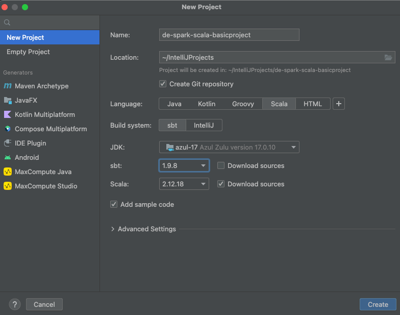

# Simple ETL Process using Spark & Scala
Since I am coming from PySpark, the idea is to create a very simple structure to run & test a Spark process using Scala.
Keeping some good practices and incorporating some of them for this new (for me) language.

## Environment
* Used IDE: IntelliJ IDEA 2022.1.4 (Community Edition)
* sbt: 1.9.8
* Spark version: 3.5.0
* Scala version: 2.12.18
    * scalatest 3.2.17
* Notebook: Zeppelin
* Test data:

### Setting up IntelliJ
New > Project



## Test
From the CLI run: `sbt test`
```shell
$ sbt test
...
[info] uTests:
[info] - Mock Test 'add' function: 2 + 4 => 6
[info] - Test 'highestClosingPricesPerYear' Method
[info] Run completed in 32 seconds, 972 milliseconds.
[info] Total number of tests run: 2
[info] Suites: completed 1, aborted 0
[info] Tests: succeeded 2, failed 0, canceled 0, ignored 0, pending 0
[info] All tests passed.
[success] Total time: 40 s, completed Feb 23, 2024 2:36:48 PM
```

## Build the project
* SCALA_VERSION=2.12
* CODE_VERSION=0.1.0   (See the _build.sbt_ file)

Once the code have been tested, from the project's root folder, execute: `sbt package`

This will create a jar file: _..<project name>/target/scala-$SCALA_VERSION/spark-scala212_$SCALA_VERSION-$CODE_VERSION-SNAPSHOT.jar_

## Running the code
From an environment with the same version of Spark and Scala run:
```shell
spark-submit --master "local[*]" spark-scala212_2.12-0.1.0-SNAPSHOT.jar \
      --path_to_file='path_to_csv_file' \
      --dest_path=path to save the results
```


